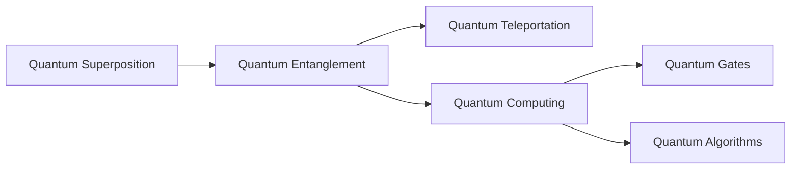

# BookForge — AI-Powered PDF Book Generator Plugin

A slash command plugin for **Claude Code** and **OpenCode** that generates professional PDF books from AI research on any topic.

## Background

The plugin orchestrates a multi-phase pipeline: web research → obsidian-linked knowledge graph → outline approval → chapter writing → draft review → PDF compilation via `nix-shell` (Pandoc + XeLaTeX + mermaid-filter). The output is a polished A4 PDF with internal cross-references, table of contents, syntax-highlighted code, rendered Mermaid diagrams, and IEEE-style bibliography.

---

## User Review Required

> [!IMPORTANT]
> **Dual-platform support**: The slash command format is nearly identical between Claude Code (`.claude/commands/`) and OpenCode (`.opencode/commands/`). The plan creates **one shared prompt file** and symlinks/copies it to both locations, so you get the same command on both platforms. Confirm this is desired, or should we target only one?

> [!WARNING]
> **Nix is a hard requirement.** If `nix-shell` is not found, the plugin will print an error with install instructions and abort. No fallback.

> [!IMPORTANT]
> **LaTeX template**: I'll create a custom minimal-modern template inspired by Eisvogel but lighter. It will use **Source Serif 4** (body), **Inter** (headings), and **JetBrains Mono** (code) — all available in Nix. If you prefer different fonts, let me know.

---

## Open Questions

1. **Book output location**: I'll create everything under `./books/<sanitized-topic-name>/`. The final PDF and all research artifacts stay there permanently. Good?
2. **Maximum chapter count**: Should there be a cap, or fully user-controlled via outline approval?
3. **Image generation**: Should diagrams beyond Mermaid (e.g., conceptual illustrations) be generated via AI image tools, or text-only + Mermaid for now?

---

## Proposed Changes

### Architecture Overview

```
/project-root/
├── .claude/commands/generate-book.md     # Claude Code slash command
├── .opencode/commands/generate-book.md   # OpenCode slash command (same content)
└── books/
    └── <topic-name>/
        ├── research/                     # Phase 1: Knowledge graph
        │   ├── _index.md                 # Master index of all research notes
        │   ├── quantum-entanglement.md   # Individual concept note
        │   ├── bell-theorem.md           # With [[wiki-links]] to related notes
        │   └── ...
        ├── outline.md                    # Phase 2: User-approved TOC
        ├── draft/                        # Phase 3: Chapter drafts
        │   ├── 01-introduction.md
        │   ├── 02-fundamentals.md
        │   └── ...
        ├── book.md                       # Phase 4: Final assembled book
        ├── references.bib                # BibTeX bibliography
        ├── ieee.csl                      # IEEE citation style
        ├── template.latex                # Custom LaTeX template
        ├── shell.nix                     # Nix environment for PDF build
        └── book.pdf                      # Phase 5: Final output
```

---

### Component 1: Slash Command Prompt

#### [NEW] `.claude/commands/generate-book.md`
#### [NEW] `.opencode/commands/generate-book.md`

The slash command prompt file. This is the **brain** of the plugin — a carefully engineered mega-prompt that instructs the AI to execute the full pipeline. Both files will have identical content.

**Key design**: The prompt is structured as a **state machine** with 5 explicit phases. The AI must complete each phase and get user confirmation before proceeding. This ensures:
- User can review/modify the outline before writing begins
- User can review the full draft before PDF generation
- Failures at any phase can be retried without restarting

```yaml
---
description: "Generate a professional PDF book on any topic"
argument-hint: "<topic> [--chapters N] [--depth introductory|intermediate|advanced]"
allowed-tools: [Bash, Read, Write, Grep, WebSearch, Edit]
---
```

**Prompt structure** (summarized):

```
Phase 1 — RESEARCH
  → Parse $ARGUMENTS for topic, chapter count, depth
  → Create books/<topic>/research/ directory
  → Web search for 10-15 high-quality sources
  → For each major concept, create an individual .md file
  → Use [[obsidian-links]] between related concepts
  → Track all sources in a _sources.md file
  → Create _index.md as the master map

Phase 2 — OUTLINE
  → Analyze the knowledge graph
  → Generate outline.md with chapter structure
  → Present to user for approval
  → STOP and wait for user feedback

Phase 3 — WRITE
  → For each chapter in the approved outline:
    → Walk relevant research notes via [[links]]
    → Write chapter draft with:
      - Internal cross-references: [Section Title](#section-id)
      - Citation keys: [@source-key]
      - Mermaid diagrams where helpful
      - Code blocks with language tags
    → Save to draft/NN-chapter-name.md
  → Generate references.bib from all cited sources

Phase 4 — ASSEMBLE & REVIEW
  → Concatenate all chapters into book.md
  → Add YAML frontmatter with metadata
  → Add \index{} entries for key terms
  → Resolve all [[wiki-links]] to proper cross-refs
  → Present draft to user for review
  → STOP and wait for user approval

Phase 5 — BUILD PDF
  → Write shell.nix, template.latex, ieee.csl
  → Run: nix-shell shell.nix --run "build-book.sh"
  → Build script handles:
    pandoc → .tex → xelatex (×3 for index) → PDF
  → Report success with file path
```

---

### Component 2: Obsidian-Style Knowledge Graph

The research phase creates interconnected markdown notes. Each note follows this format:

```markdown
# Quantum Entanglement

## Summary
Brief overview of the concept...

## Key Points
- Point 1
- Point 2

## Relations
- Builds on: [[quantum-superposition]]
- Required by: [[quantum-teleportation]], [[quantum-computing]]
- Contrasts with: [[classical-correlation]]
- See also: [[bell-theorem]], [[epr-paradox]]

## Sources
- [@einstein1935] Einstein, Podolsky, Rosen (1935)
- [URL: https://example.com/entanglement](https://example.com/entanglement)

## Notes
Detailed research notes...
```

The `_index.md` file acts as the **graph map**:

```markdown
# Research Index: Quantum Computing

## Concept Map


## All Notes
- [[quantum-superposition]] — Foundation concept
- [[quantum-entanglement]] — Links to: superposition, teleportation
- ...
```

**Why this matters**: When the AI writes chapters, it traverses these links to ensure:
1. Concepts are introduced before they're referenced
2. Cross-references in the final book are accurate
3. No orphan concepts (every note is reachable)
4. The writing follows a logical dependency order

---

### Component 3: LaTeX Template

#### [NEW] `template.latex` (generated per-book)

A custom minimal-modern LaTeX template. Key features:

```latex
% Document class
\documentclass[a4paper, 12pt, oneside]{book}

% Typography — modern, clean fonts via fontspec (XeLaTeX)
\usepackage{fontspec}
\setmainfont{Source Serif 4}
\setsansfont{Inter}
\setmonofont{JetBrains Mono}[Scale=0.85]

% Page geometry — generous margins for readability
\usepackage[a4paper, margin=2.5cm]{geometry}

% Colors — muted, professional palette
\usepackage{xcolor}
\definecolor{linkcolor}{HTML}{2563EB}    % Blue for links
\definecolor{codeblock}{HTML}{F8F9FA}    % Light gray code bg
\definecolor{accent}{HTML}{1E293B}       % Dark slate for headings

% Hyperlinks — clickable cross-references and TOC
\usepackage{hyperref}
\hypersetup{
  colorlinks=true,
  linkcolor=linkcolor,
  urlcolor=linkcolor,
  citecolor=linkcolor,
  bookmarks=true,
  bookmarksnumbered=true
}

% Code highlighting — via listings or minted
\usepackage{listings}
\lstset{
  backgroundcolor=\color{codeblock},
  basicstyle=\ttfamily\small,
  breaklines=true,
  frame=single,
  rulecolor=\color{gray!30}
}

% Index support
\usepackage{makeidx}
\makeindex

% Chapter styling — clean, minimal
\usepackage{titlesec}
\titleformat{\chapter}[display]
  {\sffamily\bfseries\Huge\color{accent}}
  {\chaptertitlename\ \thechapter}{20pt}{\Huge}

% Header/footer — minimal
\usepackage{fancyhdr}
\pagestyle{fancy}
\fancyhf{}
\fancyhead[L]{\small\sffamily\leftmark}
\fancyhead[R]{\small\sffamily\thepage}
\renewcommand{\headrulewidth}{0.4pt}

% Line spacing
\usepackage{setspace}
\setstretch{1.3}

% Graphics for Mermaid diagrams
\usepackage{graphicx}
\usepackage{float}
```

**Design philosophy**:
- **Serif body text** (Source Serif 4) for long-form readability
- **Sans-serif headings** (Inter) for modern contrast
- **Monospace code** (JetBrains Mono) scaled down slightly
- **Muted blue links** — visible but not distracting
- **Clean chapter openings** — large sans-serif title, no decorative fluff
- **Generous line spacing** (1.3) for comfortable reading

---

### Component 4: Nix Environment

#### [NEW] `shell.nix` (generated per-book)

```nix
{ pkgs ? import <nixpkgs> {} }:

pkgs.mkShell {
  buildInputs = [
    pkgs.pandoc
    pkgs.pandoc-crossref
    pkgs.haskellPackages.pandoc-crossref  # for section refs
    (pkgs.texlive.combine {
      inherit (pkgs.texlive)
        scheme-medium
        collection-fontsextra      # For Source Serif, Inter, JetBrains Mono
        collection-latexextra      # makeidx, titlesec, fancyhdr, etc.
        collection-fontsrecommended
        latexmk;
    })
    pkgs.nodePackages.mermaid-filter  # Mermaid → image conversion
    pkgs.chromium                     # Required by mermaid-cli (puppeteer)
  ];

  shellHook = ''
    export PUPPETEER_EXECUTABLE_PATH="${pkgs.chromium}/bin/chromium"
    echo "BookForge build environment ready."
  '';
}
```

---

### Component 5: Build Script

#### [NEW] `build-book.sh` (generated per-book)

```bash
#!/usr/bin/env bash
set -euo pipefail

BOOK_DIR="$(cd "$(dirname "$0")" && pwd)"
cd "$BOOK_DIR"

echo "=== BookForge: Building PDF ==="

# Step 1: Convert MD → TEX (with mermaid rendering)
pandoc book.md \
  -o book.tex \
  --template=template.latex \
  --pdf-engine=xelatex \
  -F mermaid-filter \
  --citeproc \
  --bibliography=references.bib \
  --csl=ieee.csl \
  --toc \
  --toc-depth=3 \
  --number-sections \
  --listings \
  -V documentclass=book \
  -V papersize=a4

# Step 2: XeLaTeX passes (3x for cross-refs + index)
xelatex -interaction=nonstopmode book.tex
makeindex book.idx 2>/dev/null || true
xelatex -interaction=nonstopmode book.tex
xelatex -interaction=nonstopmode book.tex

# Step 3: Cleanup auxiliary files
rm -f book.{aux,log,idx,ilg,ind,out,toc,bbl,blg,tex}

echo "=== BookForge: Done! ==="
echo "PDF: $BOOK_DIR/book.pdf"
```

---

### Component 6: IEEE Citation Support

#### [NEW] `ieee.csl` (generated per-book)

Downloaded/embedded from the [Zotero CSL repository](https://www.zotero.org/styles/ieee). This is a standard ~500-line XML file that formats citations as `[1]`, `[2]`, etc. with a numbered bibliography at the end.

#### [NEW] `references.bib` (generated during writing)

Auto-generated BibTeX file from research sources:

```bibtex
@article{einstein1935,
  author  = {Einstein, A. and Podolsky, B. and Rosen, N.},
  title   = {Can Quantum-Mechanical Description of Physical Reality Be Considered Complete?},
  journal = {Physical Review},
  year    = {1935},
  volume  = {47},
  pages   = {777--780},
  url     = {https://doi.org/10.1103/PhysRev.47.777}
}

@misc{ibm2024quantum,
  author = {{IBM Research}},
  title  = {What is Quantum Computing?},
  year   = {2024},
  url    = {https://www.ibm.com/quantum/what-is-quantum-computing}
}
```

---

## POC Plan

Before building the full plugin, I propose a **minimal POC** to validate the entire pipeline end-to-end:

### POC Scope
- **Topic**: Small, well-defined topic (e.g., "Introduction to Git" — ~3 chapters)
- **Skip**: User approval steps (hardcoded outline)
- **Test**: Every component of the pipeline

### POC Steps

| # | Step | What we validate |
|---|------|-----------------|
| 1 | Create folder structure + 3-4 research notes with `[[links]]` | Obsidian-style linking works |
| 2 | Write `outline.md` | Structure generation |
| 3 | Write 3 short chapters with `[@citations]`, Mermaid, code blocks | Content generation + citations |
| 4 | Assemble `book.md` with YAML frontmatter | Assembly pipeline |
| 5 | Write `shell.nix`, `template.latex`, `ieee.csl`, `references.bib` | All build assets |
| 6 | Run `nix-shell --run ./build-book.sh` | Full PDF build |
| 7 | Verify PDF has: TOC, internal links, Mermaid diagrams, code highlighting, bibliography | Output quality |

### POC Deliverables
- A working 3-chapter PDF book on "Introduction to Git"
- Validated `shell.nix` environment (exact packages needed)
- Validated LaTeX template
- Findings document noting what worked, what needed adjustment
- All learnings feed into the final plugin prompt

---

## Verification Plan

### Automated Tests
1. **Nix environment**: `nix-shell shell.nix --run "pandoc --version && xelatex --version && mermaid-filter --help"`
2. **PDF generation**: Run `build-book.sh` and check exit code
3. **PDF validation**: Use `pdfinfo book.pdf` to verify page count, metadata
4. **Link validation**: Use `pdftotext` + grep to verify cross-references resolved

### Manual Verification
1. Open the PDF and verify:
   - TOC links work (click chapter → jumps to page)
   - Internal cross-references work ("See Section 2.3" is clickable)
   - Mermaid diagrams render correctly
   - Code blocks are syntax-highlighted
   - Bibliography at the end with IEEE `[1]` format
   - Index at the end with correct page numbers
   - Fonts are correct (serif body, sans headings, mono code)
   - Page layout is A4 with comfortable margins
